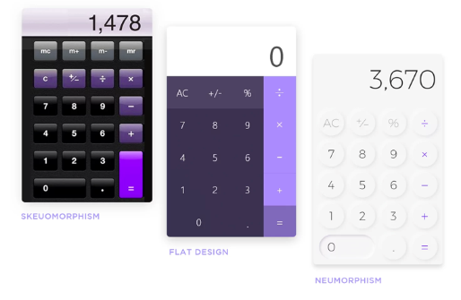
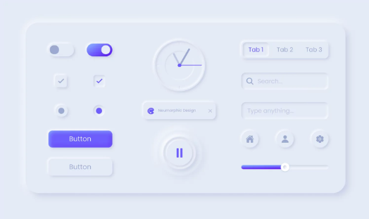

# 🌁 Neumorphism in User Interfaces

## 💁🏻‍♂️ Writer

- 이승환

## 🖥 Demo

* `Live Demo on Netlify:` <a href="" target="\_blank">https://.netlify.app/</a>

## 🤔 What is Neumorphism?

- `Neumorphism(뉴모피즘)` 은 `skeuomorphic(스큐모픽)` 디자인에 대한 새로운 견해이다.
  Neumorphism 의 주요 초점은 `실제 세계` 와 `디지털 세계` 간의 대비나 유사성에 있는 것이 아니라, `색상 파레트` 를 이용한 `UI 컴포넌트` 생성에 있다.

